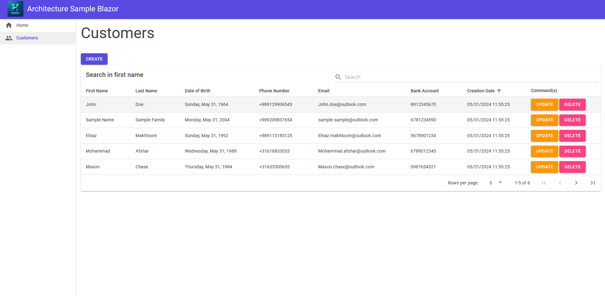

# Architecture Sample
Architecture Sample with CQRS,DDD,TDD and BDD

## Prerequisites

Before you begin, ensure you have the following tools installed:

- Visual Studio (with .NET SDK)
- Redis (for cache)
- MongoDb (for logging in production)
- Microsoft Sql Server (for database in production)

## Getting Started

1. Clone this repository:

   ```bash
   git clone https://github.com/paymantatar/ArchitectureDotnet8Sample
   ```

2. Install dependencies:

   ```bash
   dotnet restore
   ```

3. Build the solution:

   ```bash
   dotnet build
   ```


## Technologies Used

* <a href="https://dotnet.microsoft.com/en-us/apps/aspnet" target="_blank">ASP.NET Core</a>
* <a href="https://learn.microsoft.com/en-us/dotnet/core/extensions/dependency-injection" target="_blank">.NET Core Native DI</a>
* <a href="https://learn.microsoft.com/en-us/ef/core/" target="_blank">Entity Framework Core</a>
* <a href="https://xunit.net/" target="_blank">XUnit</a> for unit and integration testing.
* <a href="https://automapper.org/" target="_blank">AutoMapper</a>
* <a href="https://fluentvalidation.net/" target="_blank">FluentValidation</a>
* <a href="https://swagger.io/" target="_blank">Swagger</a>
* <a href="https://specflow.org/" target="_blank">Specflow</a> for BDD
* <a href="https://fluentassertions.com/" target="_blank">Fluent Assertions</a>
* <a href="https://github.com/jbogard/MediatR" target="_blank">MediatR</a>
* <a href="https://mudblazor.com/" target="_blank">Mud Blazor</a>
* <a href="https://nlog-project.org/" target="_blank">NLog</a>
* <a href="https://github.com/App-vNext/Polly" target="_blank">Polly</a>
* <a href="https://github.com/khellang/Scrutor" target="_blank">Scrutor</a>
* <a href="https://github.com/twcclegg/libphonenumber-csharp" target="_blank">libphonenumber-csharp</a> for phone validation

A screenshot of the app:

